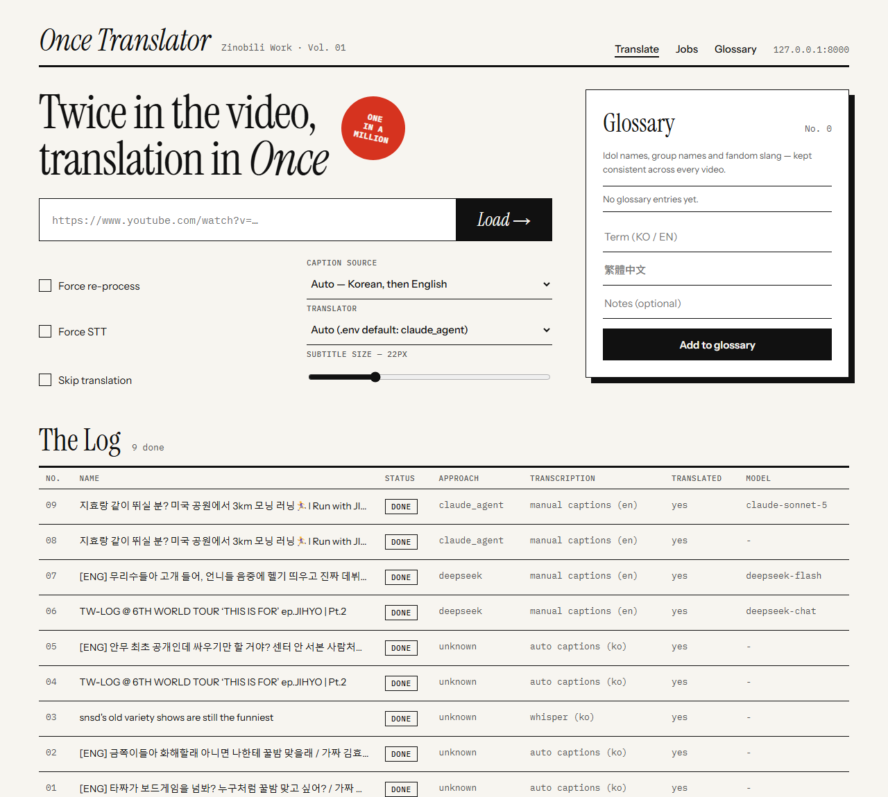
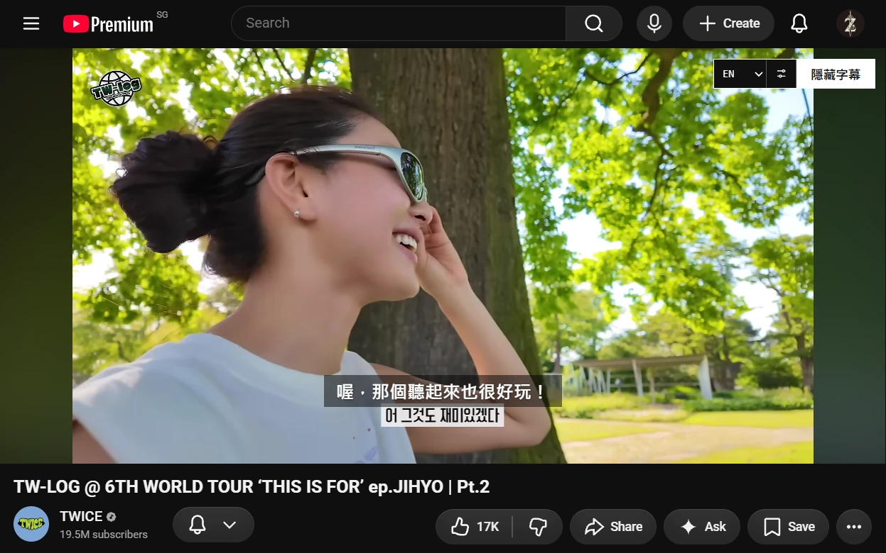
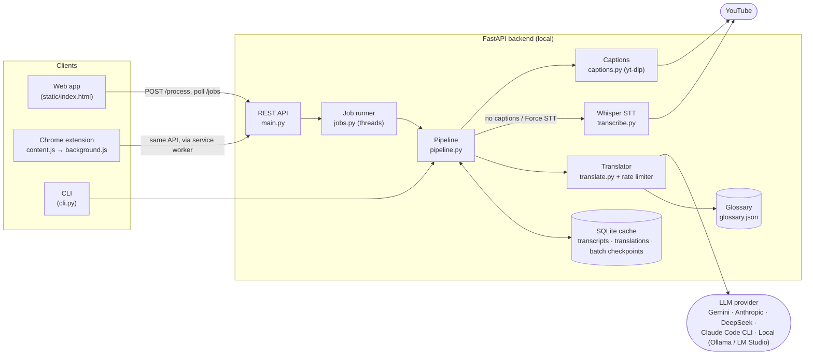

# Once Translator

*Twice in the video, translation in Once.*

**Web app** - paste a link, watch with synced subtitles, and see every processed video:



**On YouTube** - the Chrome extension overlays Traditional Chinese subtitles right on the video:



Watch K-pop YouTube videos with Traditional Chinese subtitles, translated with an LLM for
fandom-aware nuance, instead of relying on Korean audio or English captions.

## SAD



- **Three clients, one backend:** the web app and Chrome extension call the same local
  FastAPI server; the CLI runs the pipeline directly without the server.
- **Async jobs:** `POST /process` returns a `job_id` immediately and runs the pipeline in a
  background thread; clients poll `/jobs/{id}` for progress.
- **Source-text fallback:** YouTube captions (Korean → English, manual before auto) first,
  local Whisper transcription only when there are none.
- **Pluggable translation:** one translator module with swappable LLM providers, a shared
  glossary for consistent names/slang, and rate limiting for free-tier quotas.
- **Two-level cache:** transcripts and translations are cached separately in SQLite (one
  transcript can have several provider/model variants), and per-batch checkpoints let a failed
  job resume instead of re-paying for finished batches.

## Status

**Stage 1**: backend pipeline, usable via CLI or a local API. **Done.**
**Stage 2**: local web app - paste a URL, watch with a synced subtitle overlay,
or download the `.srt`. **Done.**
**Stage 3 (current)**: Chrome extension - overlay directly on youtube.com while watching
normally. **Done.**
Later stages: live-stream support.

## How it works

1. Fetches the video's existing YouTube captions (prefers Korean, falls back to English;
   manual captions preferred over auto-generated).
2. If a video has no captions at all, transcribes the audio locally with Whisper.
3. Translates the Korean/English text into Traditional Chinese using an LLM (Gemini, Claude,
   or DeepSeek, see below), applying an editable glossary (`backend/data/glossary.json`) so idol
   names, group names, and fandom slang stay consistent across videos.
4. Caches the result (SQLite) so re-processing the same video is instant and free.

## Setup

```bash
cd backend
python -m venv .venv
.venv\Scripts\pip install -r requirements.txt
copy .env.example .env
```

Edit `backend/.env` to choose a translation provider:

- **`TRANSLATION_PROVIDER=gemini`** (default, good for a free POC): set `GEMINI_API_KEY` to a
  free key from https://aistudio.google.com/apikey. Free-tier requests may be used by Google
  to improve their models — fine for casual show captions, worth knowing.
- **`TRANSLATION_PROVIDER=anthropic`** (paid, generally higher translation nuance): set
  `ANTHROPIC_API_KEY` to your own key from https://console.anthropic.com/. See
  [cost notes](#cost) below.
- **`TRANSLATION_PROVIDER=deepseek`** (paid, very cheap, no Gemini-style daily quota): set
  `DEEPSEEK_API_KEY` to your own key from https://platform.deepseek.com/api_keys. It's a
  mainland Chinese model, so output may lean toward Simplified-Chinese vocabulary/idiom even
  when asked for zh-TW — check a sample of real subtitles before relying on it.
- **`TRANSLATION_PROVIDER=local`** (free, private, runs on your own machine): set
  `LOCAL_LLM_BASE_URL` to your OpenAI-compatible server (Ollama's default,
  `http://localhost:11434/v1`, is used if you don't set it; LM Studio's default is
  `http://localhost:1234/v1`). Unlike the other providers, the model isn't fixed in `.env` —
  the web app fetches whatever models that server currently has loaded and shows them in a
  **Local LLM model** dropdown next to the URL field, so you can switch models per request.
  Quality depends entirely on the model you have loaded.
- **`TRANSLATION_PROVIDER=claude_agent`** (uses a Claude subscription instead of API billing):
  runs the Claude Code CLI locally as a subprocess (via the Claude Agent SDK) instead of
  calling the Anthropic API directly. No tools are granted to it — it's a plain text-in/
  text-out translation call, same prompts as the `anthropic` provider, just a different
  transport. Setup:
  1. Install Node.js, then the CLI: `npm install -g @anthropic-ai/claude-code`.
  2. Run `claude login` once on this machine and sign in with your Claude account — this uses
     your subscription's usage allowance, not the pay-per-token API (no `ANTHROPIC_API_KEY`
     needed for this provider; that variable is only read by `TRANSLATION_PROVIDER=anthropic`).
  3. Optionally set `CLAUDE_AGENT_MODEL` in `.env` to pin a specific model; leave it blank to
     use the CLI's own default.

  Since this is a subscription login rather than a portable API key, it only works on a
  machine where you've personally run `claude login` — it won't work out of the box on a
  server someone else deploys. Subscription usage also has its own rate/usage caps, separate
  from the API's, worth watching if you're batch-translating a lot of videos.

Only the key for the provider you selected is required.

## Run the automated tests

```bash
cd backend
.venv\Scripts\python -m pytest tests/ -v
```

Unit tests for the trickiest pure logic - VTT caption parsing/dedup (using a real captured
sample), the SRT formatter, the rate limiter, Gemini quota-error detection, glossary storage,
and YouTube URL parsing. No network access or API keys needed; everything below this still
needs manual testing (real YouTube videos, real LLM calls, the extension's page injection).

## Test the web app

```bash
cd backend
.venv\Scripts\uvicorn app.main:app --reload
```

Open http://127.0.0.1:8000 in a browser:

1. Paste a YouTube URL and click **Load**. Status updates show the current stage (fetching
   captions / transcribing / translating) - translating ~500 lines can take a minute or two
   on Gemini's free tier.
2. Once done, the video plays inline with a Traditional Chinese subtitle overlay synced to
   playback (if YouTube's own captions also appear, click the video's **CC** button to turn
   them off so they don't clash with the overlay).
3. Use **Download .srt** to get the subtitle file for any other player (e.g. VLC on a
   downloaded copy of the video).
4. The **Glossary** panel lets you add/remove terms (idol names, group names, fandom slang)
   that future translations will use for consistency.

Re-loading the same URL is instant (served from cache) unless you check **Force re-process**.

Two more checkboxes control the pipeline itself:

- **Force STT** - ignore any existing YouTube captions and always transcribe the audio with
  Whisper. Useful when a video's captions are wrong/low-quality/missing entirely for your
  purposes.
- **Skip translation** - output the original-language transcript as-is, with no LLM call at
  all. Useful to check STT/caption quality on its own, or as a quota-free fallback when the
  translation provider is rate-limited/exhausted (see [Cost](#cost)). Results from this mode
  are never cached or written over a video's real translated result.

## Test on the CLI

```bash
cd backend
.venv\Scripts\python cli.py "https://www.youtube.com/watch?v=yLGXM5O8v5Q"
# add --force-stt and/or --skip-translation for the same overrides as the web app
```

This writes a `<video_id>.srt` file with Traditional Chinese subtitles directly, without
starting the web server.

## Test the Chrome extension

The backend must be running first (`.venv\Scripts\uvicorn app.main:app --reload` from `backend/`).

1. Open `chrome://extensions` in Chrome, enable **Developer mode** (top-right toggle).
2. Click **Load unpacked** and select the `extension/` folder.
3. Go to any YouTube video (e.g. `https://www.youtube.com/watch?v=yLGXM5O8v5Q`). A small
   **翻譯** (Translate) button appears in the top-right corner of the player.
4. Click it - status text shows progress (fetching/transcribing/translating), then the
   button becomes **隱藏字幕** (Hide subtitles) and the overlay starts syncing with playback.
   If YouTube's native captions also appear, click the video's own **CC** button to turn
   them off.
5. Click the extension's toolbar icon to change the backend URL if it's not running on the
   default `http://127.0.0.1:8000` (e.g. if you later host the backend elsewhere), or to
   toggle **Force STT** / **Skip translation** (same meaning as the web app's checkboxes -
   see [Test the web app](#test-the-web-app)) - these apply the next time you click 翻譯.

The extension talks to the backend from its background service worker (not the page itself),
so no CORS configuration is needed on the backend.

## API reference

```bash
# Start a translation job (returns a job_id immediately; processing runs in the background)
# Optional body fields: force_refresh, force_stt, skip_translation (all default false)
curl -X POST http://127.0.0.1:8000/process -H "Content-Type: application/json" \
  -d "{\"url\": \"https://www.youtube.com/watch?v=yLGXM5O8v5Q\"}"

# Poll job status/result
curl http://127.0.0.1:8000/jobs/<job_id>

# Once done, fetch the cached subtitle file directly
curl http://127.0.0.1:8000/subtitles/yLGXM5O8v5Q.srt
```

Glossary management:

```bash
curl -X POST http://127.0.0.1:8000/glossary -H "Content-Type: application/json" \
  -d "{\"term\": \"오빌리\", \"translation\": \"OB\", \"notes\": \"stage name, keep as-is\"}"

curl http://127.0.0.1:8000/glossary
```

See [backlog.md](backlog.md) for known open issues (e.g. YouTube's yt-dlp bot-wall).

## Cost

- **Gemini**: free tier, rate-limited two ways - both confirmed by hitting them directly, since
  Google no longer publishes a fixed table:
  - **~5 requests/minute** for `gemini-3.6-flash` - the backend paces requests to stay under
    this automatically (`GEMINI_RPM` in `.env`), so it shouldn't surface as an error.
  - **As low as 20 requests/day** for the same model - this is the one that actually bites,
    since it can't be paced around. `TRANSLATE_BATCH_SIZE` (default 200 lines/request) exists
    to stretch a day's quota across more videos; hitting it anyway fails fast with a clear
    message rather than wasting minutes retrying (it resets roughly every 24h). If you're
    doing more than light testing, switch to `TRANSLATION_PROVIDER=anthropic`.
- **Anthropic** (`claude-sonnet-5`): pay-as-you-go, $2/1M input tokens + $10/1M output tokens.
  A ~1-hour dialogue-heavy episode (~500 caption lines) costs roughly $0.10-0.15; a short MV
  with sparse lyrics costs a fraction of a cent. Charged once per video — cached re-processing
  is free.
- **Claude Code** (`claude_agent`): no per-token API charge — it draws on your Claude
  subscription's usage allowance instead (via `claude login`), so cost isn't measured in
  dollars here, but subscription usage caps still apply.
- **DeepSeek** (`deepseek-chat`): pay-as-you-go, roughly $0.28/1M input tokens + $0.42/1M output
  tokens (standard pricing; DeepSeek also runs cheaper off-peak discounts) — well under a cent
  per video, with no daily request cap to hit. Check https://api-docs.deepseek.com/quick_start/pricing
  for current rates before relying on this number.
- **Reasoning ("thinking") tokens can dominate the bill.** Some models think by default and bill
  that as output; on DeepSeek `deepseek-flash` it was 96% of output tokens for subtitle
  translation. See [docs/thinking-mode.md](docs/thinking-mode.md) for measurements, per-provider
  settings, and how to check your own usage.
- Everything else (caption fetch, Whisper fallback, caching) runs locally and is free.
